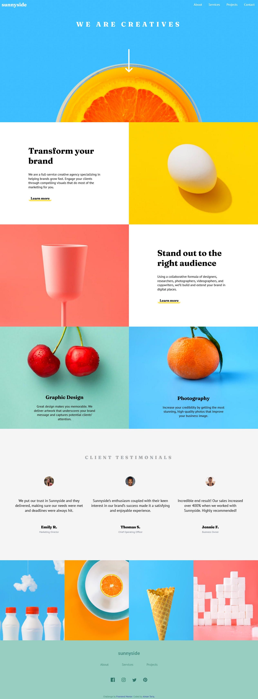

# Frontend Mentor - Sunnyside agency landing page solution

This is a solution to the [Sunnyside agency landing page challenge on Frontend Mentor](https://www.frontendmentor.io/challenges/sunnyside-agency-landing-page-7yVs3B6ef). Frontend Mentor challenges help you improve your coding skills by building realistic projects.

## Table of contents

- [Overview](#overview)
  - [Screenshot](#screenshot)
  - [Links](#links)
- [My process](#my-process)
  - [Built with](#built-with)
  - [What I learned](#what-i-learned)
  - [Continued development](#continued-development)
  - [Useful resources](#useful-resources)

## Overview

### Screenshot



### Links

- Live Site [URL](https://aim-t.github.io/sunnyside-agency-landing-page-main/)

## My process

### Built with

- Semantic HTML5 markup
- CSS custom properties
- Flexbox
- CSS Grid

### What I learned
The About section caused a lot of issues because of the images. Getting it finally right was a proud moment. 
```html
<!-- Before -->
<div class="section-image-one">
    
</div>
<div class="section-image-two">
  
</div>
```

Here, the Grid did not work as expected because of the images used in HTML. The commented out properties are some of the attempts to achieve desired results. 
```css
  /*    Before     */
.main-grid-container {
  /* max-height: auto;
    width: 100%; */
  display: grid;
  grid-template-columns: repeat(2, 1fr);
  /* grid-template-rows: repeat(3, 2fr); */
  /* grid-auto-rows: minmax(1fr, auto); */
  grid-auto-rows: minmax(250px, auto);
  background-color: white;
  /* grid-template-areas: 
        'section-transform image-transform'
        'image-stand-out section-stand-out'
        'graphic-design photography'; */
  justify-content: center;
  align-content: center;
}
```
```html
<!--    After    -->
<div class="section-image-one">

</div>
<div class="section-image-two">

</div>
```
```css
/*    After    */
.main-grid-container {
  display: grid;
  grid-template-columns: repeat(2, 1fr);
  grid-auto-rows: minmax(250px, auto);
  background-color: white;
  justify-content: center;
  align-content: center;
}
```
The navbar was quite tricky to get right because of using `position:fixed;`. This problem was soved using flexbox instead of `position`.  

### Continued development
- Work on responsiveness of this site for mobile screens 
- Learn about images in depth, since it caused major discomfort while styling the [About](./index.html) section

### Useful resources

- This [video](https://www.youtube.com/watch?v=jV8B24rSN5o) helped me with learning grid. I really liked the teaching method.
- This [tutorial](https://www.youtube.com/watch?v=fYq5PXgSsbE) is an amazing tutorial which helped me understand flexbox. I'd recommend it to anyone still learning this concept.
- This [Youtube Channel](https://www.youtube.com/kepowob) has helped me for a long time, especially with CSS. Highly recommended.  